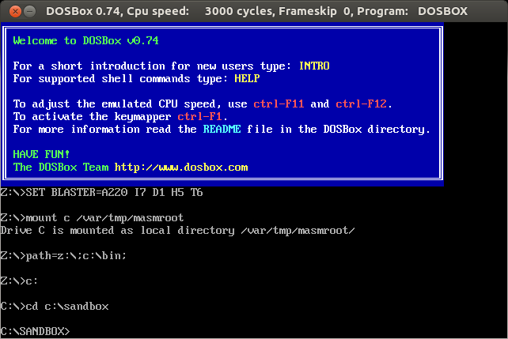
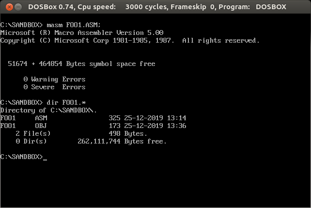
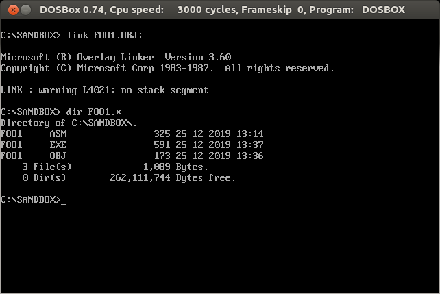
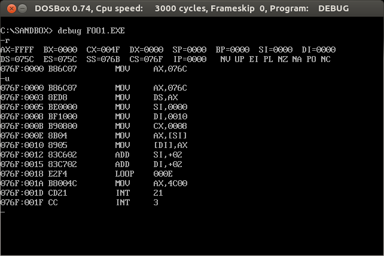
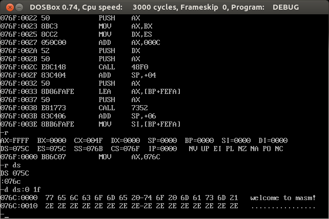
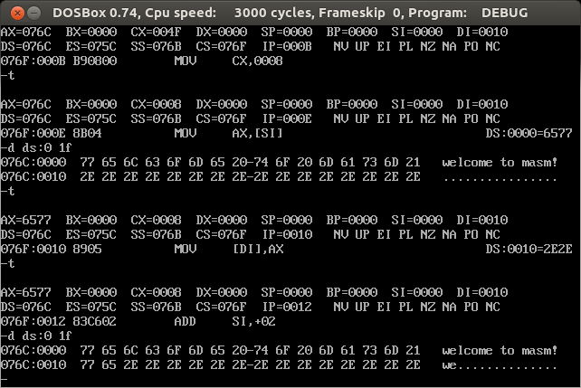
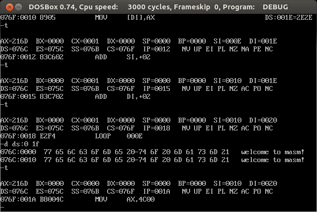
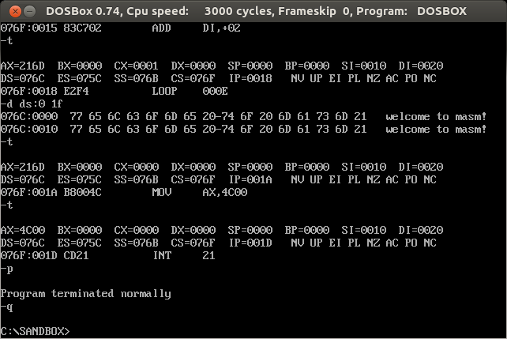

# DOSBox + MASM + DEBUG Quick Start

## 1. Setup Environment

### 1.1 Install [Ubuntu][1.1A] desktop (e.g. 16.04 LTS) via [VirtualBox][1.1B]

[1.1A]: https://ubuntu.com/download
[1.1B]: https://www.virtualbox.org/

### 1.2 Install [DOSBox][1.2A] on Ubuntu desktop
   ```bash
   $ sudo apt-get install dosbox
   ```

[1.2A]: https://www.dosbox.com/

### 1.3 Setup DOSBox

Edit ~/.DOSBox/DOSBox-0.74.conf, e.g.

   ```bash
   $ mkdir /var/tmp/masmroot
   $ mkdir /var/tmp/masmroot/bin
   $ mkdir /var/tmp/masmroot/sandbox
   $ vi ~/.DOSBox/DOSBox-0.74.conf # Add these lines in the following,
   mount c /var/tmp/masmroot
   path=z:\;c:\bin;
   c:
   cd c:\sandbox
   ```

### 1.4 Setup masm.exe, link.exe and debug.exe

e.g.
   ```bash
   $ cd $(dirname $(readlink -f quickstart.md))/../utils
   $ bash setup.sh /var/tmp/masmroot
   ```

### 1.5 Copy sample/foo1.asm

e.g.
   ```bash
   $ cd $(dirname $(readlink -f quickstart.md))/../sample/foo1
   $ cp foo1.asm /var/tmp/masmroot/sandbox
   $ cp Makefile /var/tmp/masmroot/sandbox
   ```
   
* foo1.asm looks like:
```asm
	assume cs:codesg, ds:datasg

datasg segment
	db "welcome to masm!"
	db "................................"
datasg ends

codesg segment
	start:	mov ax, datasg
		mov ds, ax
		mov si, 0
		mov di, 16
		mov cx, 8

	s:	mov ax, [si]
		mov [di], ax
		add si, 2
		add di, 2
		loop s

		mov ax, 4c00h
		int 21h
codesg ends

	end start
```


## 2. Create an exe file via DOSBox

### 2.1 Start DOSBox

* Terminal 1
   ```bash
   $ cd /var/tmp/masmroot/sandbox
   $ make cl
   ```

* Terminal 2
   ```bash
   $ dosbox
   ```
|     |
|:---:|
||
|**Figure 1 - DOSbox startup**|

### 2.2 Compile
   ```
   C:\SANDBOX> masm FOO1.ASM;
   ```
Please be noted an obj file **FOO1.OBJ** is created.

|     |
|:---:|
||
|**Figure 2 - Compile source file**|

### 2.3 Link
   ```
   C:\SANDBOX> link FOO1.OBJ;
   ```
Please be noted an exe file **FOO1.EXE** is created.

|     |
|:---:|
||
|**Figure 3 - Link obj file**|

## 3. Debug an exe file via DOSBox

   ```
   C:\SANDBOX> debug FOO1.EXE
   - r		; view all registers
   - u		; unassemble
   - t
   - t
   ... ...
   - t
   - p

   ```
e.g.

|     |
|:---:|
||
|**Figure 4 debug foo1.exe (R, U cmd)**|

|     |
|:---:|
||
|**Figure 5 debug foo1.exe (R, D cmd)**|

|     |
|:---:|
||
|**Figure 6 debug foo1.exe (T, D cmd)**|

|     |
|:---:|
||
|**Figure 7 debug foo1.exe (T, D cmd, cont)**|

|     |
|:---:|
||
|**Figure 8 debug foo1.exe (P, Q cmd)**|
